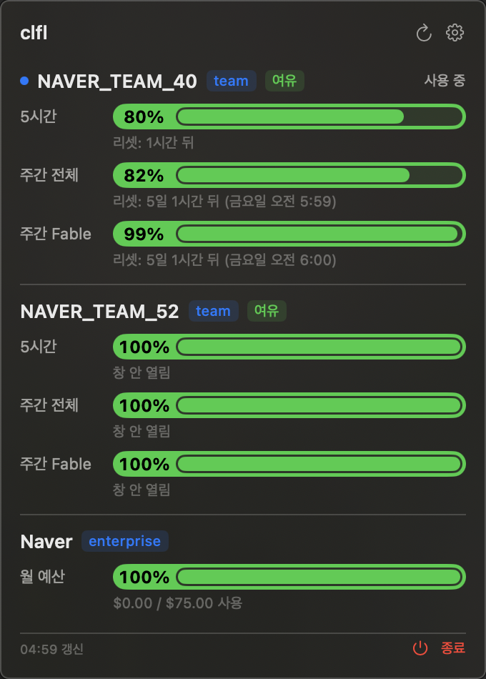
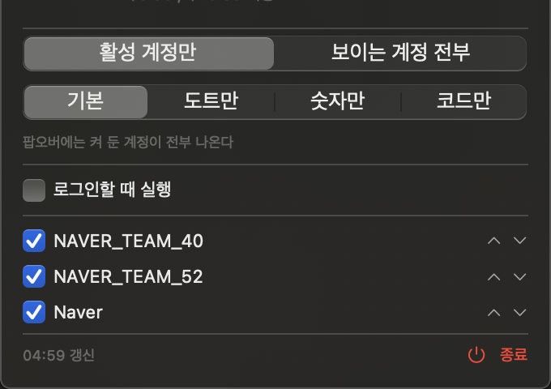

# clfl

Claude Code 데스크톱 앱의 **계정별 남은 한도**를 macOS 메뉴바에 띄운다.


앱은 지금 쓰는 계정 하나만 보여준다. 나머지가 얼마나 남았는지는 일일이
전환해 봐야 안다. clfl 은 셋을 한 번에 읽는다.

---

## 무엇이 보이나



계정마다 **5시간 / 주간 전체 / 주간 Fable** 세 창의 잔여와 리셋 시각.
리셋 줄에는 그 창이 어디쯤인지도 함께 적는다 (`리셋: 39%, 4일 6시간 뒤`).
남은 시간만으로는 5시간 창의 10분과 주간 창의 10분이 구별되지 않는다.
이 숫자는 게이지와 같은 방향으로 센다. 남은 용량 기준이면 0 으로 줄고
사용률 기준이면 100 으로 는다.
Enterprise 처럼 시간 창이 없는 플랜은 **월 예산**을 대신 보여준다.

메뉴바 막대는 코드, 숫자 두 줄, 눈금 게이지 세 줄이다. 눈금 한 칸이 5% 이고
5% 단위로 올림한다.

| 잔여 | 색 |
|---|---|
| 50% 이상 | 초록 |
| 15% 이상 | 기본색 |
| 5% 이상 | 노랑 |
| 5% 미만 | 빨강 |

---

## 설치

```
./scripts/install-app.sh
open ~/Applications/clfl.app
```

Swift 6 툴체인과 macOS 13 이상이 필요하다. Xcode 프로젝트는 없다.
`Package.swift` 로 빌드하고 스크립트가 `.app` 번들을 조립한다.

`~/Applications` 에 두는 이유는 로그인 항목 등록 때문이다. 빌드 디렉토리에
있으면 다음 빌드에 번들이 지워져 등록이 헛일이 된다.

---

## 설정



톱니를 누르면 팝오버 안에서 펼쳐진다.

- **메뉴바에 표시할 계정**: 범위를 고르는 칸과 계정 목록이 한 묶음이다.
  `창이 열려있는 계정만` 은 기본 창과 우리가 띄운 창을 따라가고,
  `설정에서 지정한 계정` 은 목록에서 켠 것을 그린다. 기준이 다르므로 창이
  열린 계정을 목록에서 꺼 뒀어도 앞 항목에는 나온다. 목록 밑 한 줄이 지금
  그 목록이 막대를 정하는지 아닌지를 알려준다
- **자세히**: 기본 / 도트만 / 숫자만 / 코드만
- **퍼센트**: 남은 용량 / 사용률. 색은 어느 쪽이든 잔여 기준이다
- 로그인할 때 실행

설정은 `~/Library/Application Support/clfl/desktop.json` 에 저장된다.
보여줄 목록이 아니라 **숨길 목록**을 담으므로 계정이 새로 생기면 자동으로 보인다.

---

## 세션 넘기기

한도에 걸려 작업이 멈췄을 때 하던 대화를 다른 계정으로 넘긴다. 팝오버 아래
`세션 넘기기` 를 누르면 창이 뜬다. 원본 계정에서 세션을 고르고 대상 계정을
정하면 끝이다.

**대화를 복사하지 않는다.** 대화는 `~/.claude/projects` 에 있고 계정 표시가
없다. 어느 계정 것인지는 420바이트짜리 레코드가 어느 폴더에 있느냐로만
정해지므로 그 파일 하나를 옮긴다. 73MB 짜리 대화도 즉시 끝나고, 한 계정만
그 대화를 가리키니 창 둘이 같은 파일을 함께 쓰는 일도 없다.

옮긴 뒤 목록에 반영하려면 그 계정의 창을 다시 띄워야 한다. 별도 창은 단추
하나로 다시 띄우고, 기본 창은 사용자 것이라 재시작하라고 말만 한다.

---

## 하지 않는 것

- **데스크톱 앱의 파일을 쓰지 않는다.** 읽기만 한다
- **추론 요청을 보내지 않는다.** 사용량 조회는 토큰을 소모하지 않는다
- **계정을 자동으로 바꾸지 않는다.** 대신 계정마다 창을 따로 띄운다.
  기본 창은 그대로 두고 다른 계정에서 이어서 일할 수 있다
  ([13 문서](docs/design/13-multi-instance.md))

토큰 갱신도 앱이 하게 두고, 만료되면 그 사실만 말한다.

### 요청을 아낀다

한 번 읽을 때 요청이 계정 수만큼 나간다. 그래서

- 기본 5분. 세 번 연속 변화가 없으면 10분, 429 를 받으면 15분
- 사람이 유발한 읽기는 60초 정숙 구간
- 계정 이름은 한 번만 조회하고 캐시
- 계정 전환은 로컬 쿠키로 5초마다 확인한다. 네트워크를 안 탄다

읽기에 실패해도 마지막으로 읽은 값을 지우지 않는다. 대신 낡았다고 표시한다.

---

## clflctl

앱 없이 같은 데이터를 보는 도구다. 개발과 점검에 쓴다.

```
./scripts/install-clflctl.sh

clflctl desktop usage              계정별 잔여
clflctl desktop usage --json       기계가 읽을 형태로
clflctl desktop orgs               아는 계정과 표시 여부
clflctl desktop hide <이름|uuid>    목록에서 뺀다
clflctl desktop bar <window|chosen> 막대에 그릴 범위
```

메뉴바 숫자와 `clflctl desktop usage` 는 항상 같은 값을 낸다.

---

## 터미널 트랙

한도에 걸리면 계정을 자동으로 바꿔주는 프록시가 저장소에 함께 있다.
**데스크톱 앱은 이 프록시를 안 탄다.** 앱이 자식 프로세스 환경에
`ANTHROPIC_BASE_URL` 을 직접 꽂고 그 이름을 잠가 두기 때문이다. 실측으로
확인했다 ([08 문서 7-4절](docs/design/08-verification.md)).

터미널 `claude` 에서는 동작하고 테스트도 통과하지만 제품으로 내놓지 않는다.
자세한 것은 [00 범위](docs/design/00-scope.md).

---

## 문서

[docs/design/00-scope.md](docs/design/00-scope.md) 를 먼저 읽는다.
지금 만드는 것과 만들다 그만둔 것, 그리고 문서 지도가 있다.

| | |
|---|---|
| [10 사용량 읽기](docs/design/10-desktop-usage.md) | 토큰 캐시, 스코프, 설정, 갱신 주기 |
| [11 메뉴바 앱](docs/design/11-menubar-app.md) | 번들, 화면 치수, 로그인 항목, 429 |
| [12 Enterprise](docs/design/12-enterprise-spend.md) | 시간 창이 없는 플랜과 월 예산 |
| [13 인스턴스 둘](docs/design/13-multi-instance.md) | 계정마다 창을 띄우고 대화를 옮긴다 |
| [진행 현황](docs/design/status.html) | 검증 사다리와 계층별 상태 (HTML) |

---

## 개발

```
swift test                  전체 테스트
swift build -c release      clflctl 릴리스
./scripts/make-app.sh       .app 번들만 만든다
```

판단은 전부 `ClflDesktop` 에 있고 `ClflApp` 에는 뷰와 상태 하나뿐이다.
잔여 계산, 이름 줄이기, 남은 시간 표기가 모두 순수 함수라 테스트가 잠근다.
뷰에 판단을 두지 않는 이유는 뷰를 테스트할 수 없기 때문이다.

`clflctl` 은 소스보다 낡았으면 실행할 때 알려준다.
